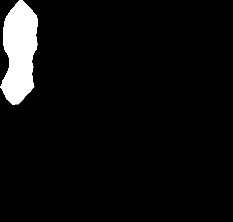

# RoadEye

## Description

A computer vision program that differentiates cars and bikes from the traffic in the video file, using only OpenCV and NumPy for image processing. Different training algorithms are provided in the comments of the `train.py` file for you to try out. 

As this model is still a prototype. In a sample of 28 incoming traffics, only 4 vehicles were detected as the wrong category (including the case where the machine confuses and decides back and forth). Thus for this specific sample of testing data, the model has an accuracy of 86%.

## Process

In summary:

- Tidy the data
    - read video and cancel background from moving objects
    - select the targeted moving objects
- Train
- Run and Test!

### Step 1: Read video file and cancel background

Used the KNN segmentation background cancellation object provided by OpenCV and converted the color space of the frame to YCrCb. Then applied the BackgroundSubtractorKNN object to the frame, obtaining a binary mask where moving objects are highlighted. Also applied median filtering to the binary mask to reduce noise.

*Moving objects are marked white and static is black*

## Step 2: Select the export the correct objects in the video

Find each highlighted moving object that is bigger than 100 pixels and export the images as raw data.

*Looks like the correct objects are selected!!*

## Step 3: Make the dimension of each image the same

To train the machine, we need each image data to have the same amount of pixels. Thus, we find the largest image in the raw data and use its dimension to enlarge the rest of the data to have the identical dimension.

Then according to the different width-length ratio of the "white objects", we put cars and bikes in separate datasets in the `train_data` folder. 

*Two resized bike and car images*

## Step 4: Training

Iterating over the subdirectories of `train_data` and collecting training data and labels, program converts them to grayscale using `cv2.cvtColor()`, and then flattens each grayscale image into a 1D array (x_img1) using gray1.flatten(). The flattened image array is appended to the list xtrain, and the corresponding label (subdirectory name) is appended to the list ytrain.

## Step 5: Run and Test

Result is as follows!

*End Result Voila!*
